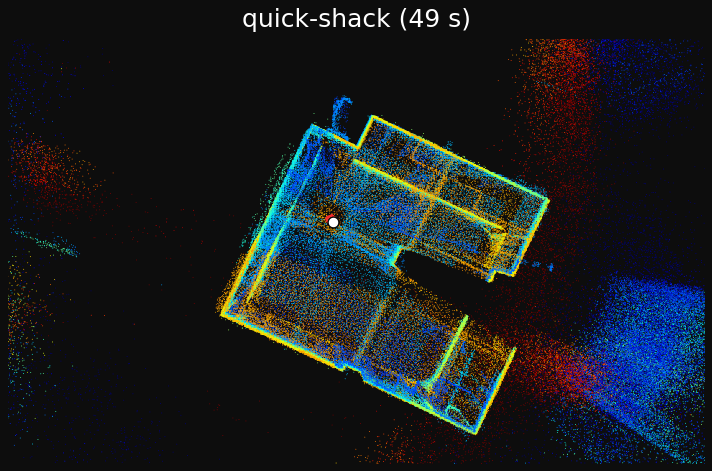
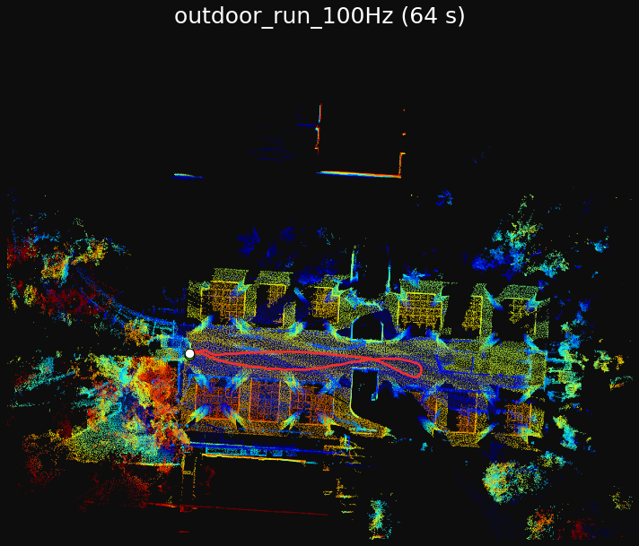
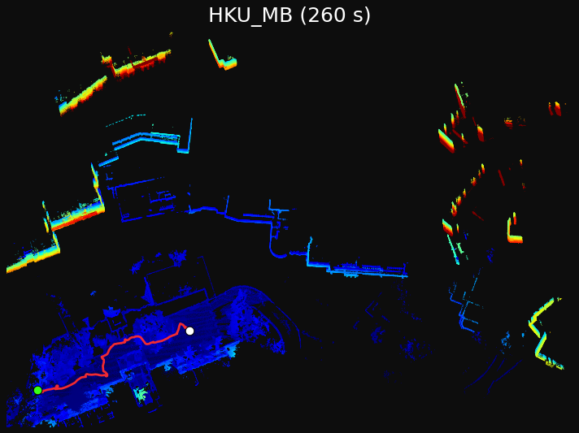
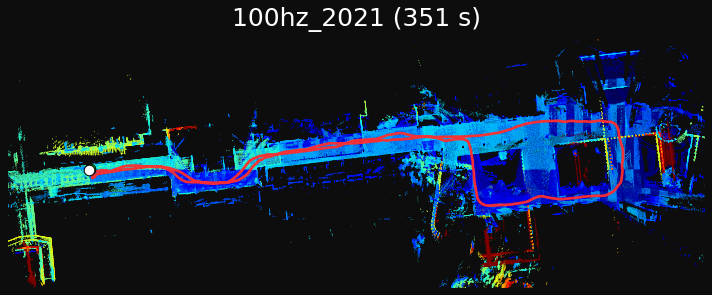
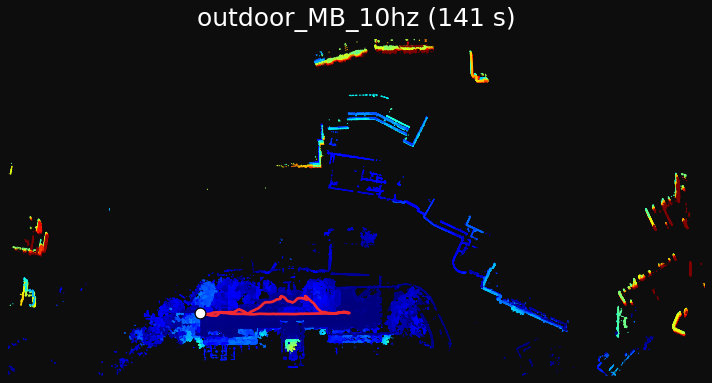
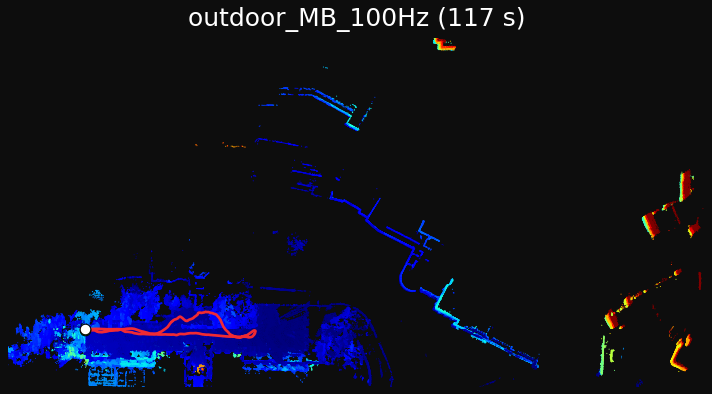

# FAST_LIO_PY

**A pure-Python reimplementation of [FAST-LIO2](https://github.com/hku-mars/FAST_LIO).**

The complete LiDAR-inertial odometry pipeline in NumPy, split into two files:

- **[`fastlio.py`](fastlio.py)** (~1 700 lines) — the **SLAM algorithm**: the iterated error-state Kalman filter (predict / update), IMU initialization + forward propagation + motion undistortion, the point-to-plane observation model, incremental-map update, and the offline main loop.
- **[`utils.py`](utils.py)** (~1 200 lines) — the **data structures and infrastructure** the algorithm operates on: SO(3)/S(2) manifold math, the 23-DOF manifold state (`StateIkfom`), the scipy incremental-map KD-tree, raw-bytes rosbag parsing, the profiling timer, config/CLI, geometry helpers, file output, and the per-frame-map aggregation + open3d visualization (`aggregate_map`, also a standalone CLI).

## Usage

**Dependencies**: `numpy`, `scipy`, `pyyaml`, and `rosbag` (Python ≥ 3.7). **No ROS installation is required** — the project only *reads* bag files, so `rosbag` can be pip-installed on its own from the [rospypi](https://github.com/rospypi/simple) index:

```bash
pip install --extra-index-url https://rospypi.github.io/simple/ rosbag
```

(Add `roslz4` from the same index if you need to read LZ4-compressed bags.) Optional: `open3d` for map **visualization** via `aggregate_map`.

**Test data**: example Livox AVIA rosbags are available from the original FAST-LIO repository — [Google Drive](https://drive.google.com/drive/folders/1CGYEJ9-wWjr8INyan6q1BZz_5VtGB-fP?usp=sharing).

> **LiDAR support**: at present only **Livox (AVIA-class) `CustomMsg`** bags are supported. Support for other LiDAR types — Velodyne / Ouster `PointCloud2` — is under active development.

### 1. Run

Run the odometry on a bag (keep `utils.py` next to `fastlio.py` — the algorithm file imports it):

```bash
python3 fastlio.py \
    --bag your_livox_avia.bag \
    --config config/avia.yaml \
    --output_dir ./out \
    --filter_surf 0.5 --filter_map 0.5 --point_filter_num 2
```

`--filter_surf` and `--filter_map` are the scan and map voxel-downsample sizes (m); `--point_filter_num` keeps every Nth input point. **If the result looks off — drift, jitter, or poor alignment — try lowering all three**: smaller values keep more points, which is more accurate at the cost of speed.

This writes `out/Log/trajectory_py_tum.txt` (TUM trajectory) and streams the map to `out/frames/` one scan at a time, so the whole map is never held in RAM.

### 2. Aggregate result & visualize

Reconstruct the dense map on demand and open an open3d viewer:

```bash
python3 utils.py --output_dir ./out [--voxel 0.1] [--no_show]
```

Options: `--voxel L` voxel-downsamples the map; `--pcd PATH` sets the output PCD path (default `out/PCD/map_aggregated.pcd`); `--no_show` writes the PCD without opening the viewer; `--no_save` visualizes without writing. Visualization needs `open3d` (`pip install open3d`); without it the PCD is still written.

## Accuracy & timing vs the original C++ FAST-LIO2

Test platform: **Intel Core i5-9300H** — 4 cores / 8 threads, 2.4 GHz base / 4.1 GHz turbo — with single-threaded BLAS (`OMP_NUM_THREADS=1`). Same-machine comparison on 6 Livox AVIA bags (wall = internal SLAM loop):

| Bag (duration) | rate | C++ | NumPy | **real-time** |
|---|---|---|---|---|
| quick-shack (49 s) | 10 Hz | 1.6 s | 9.7 s | **5.0×** |
| outdoor_MB_10hz (141 s) | 10 Hz | 12.3 s | 43.5 s | **3.2×** |
| HKU_MB (260 s) | 10 Hz | 23.9 s | 88.7 s | **2.9×** |
| outdoor_run_100Hz (64 s) | 100 Hz | 7.2 s | 47.2 s | 1.4× |
| outdoor_MB_100Hz (117 s) | 100 Hz | 11.6 s | 81.0 s | 1.4× |
| 100hz_2021 (351 s) | 100 Hz | 42.1 s | 285.3 s | 1.2× |

**Real-time:** even with single-threaded BLAS, the pure-NumPy pipeline runs **faster than real time on every bag** — 3–5× headroom at 10 Hz (~20–34 ms/scan vs the 100 ms budget), and still real-time but tight at 100 Hz (~7–8 ms vs 10 ms).

**Timing:** ≈ 5–6× the C++ wall. Single-threaded BLAS is forced on purpose — the filter's matrices are tiny, so BLAS threading only adds overhead (serial measured **−60 % wall**). The remaining gap is per-scan Python dispatch, not algorithmic overhead.

### Reconstructed maps

Top-down view of the world-frame map, colored by height, with the estimated trajectory overlaid (green ● = start, white ● = end):

<table align="center">
  <tr>
    <td></td>
    <td></td>
  </tr>
  <tr>
    <td></td>
    <td></td>
  </tr>
  <tr>
    <td></td>
    <td></td>
  </tr>
</table>

**Accuracy:** four of six bags are within a few cm of C++. The two outliers — `outdoor_MB_100Hz` (a global gravity-init tilt; trajectory *shape* is fine) and `100hz_2021` (long-run drift) — differ only by floating-point accumulation, not an algorithmic difference.

## Acknowledgements & License

This is an educational reimplementation derived from [hku-mars/FAST_LIO](https://github.com/hku-mars/FAST_LIO) (FAST-LIO2: Fast Direct LiDAR-inertial Odometry, Xu et al.), built with [Claude Code](https://claude.com/claude-code). Licensed under **GPL-2.0**, same as upstream. If you use this in academic work, please cite the original FAST-LIO2 paper.
